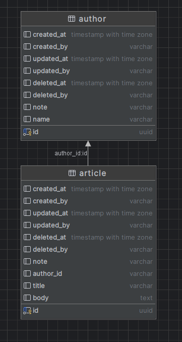
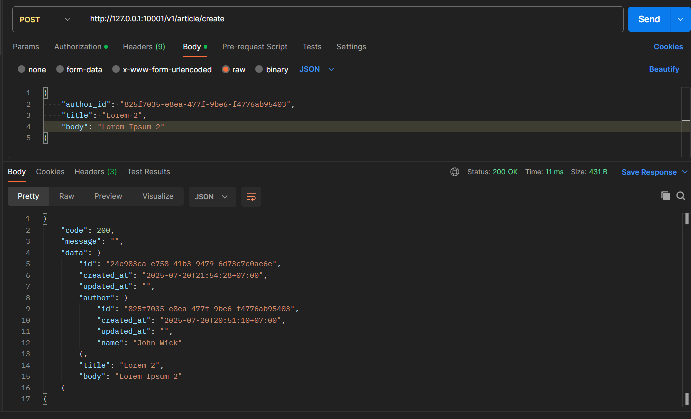
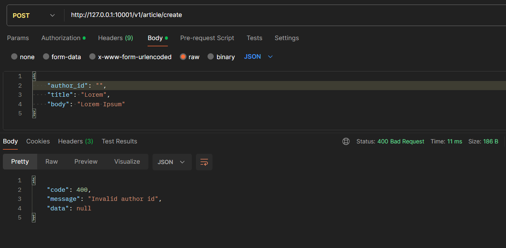
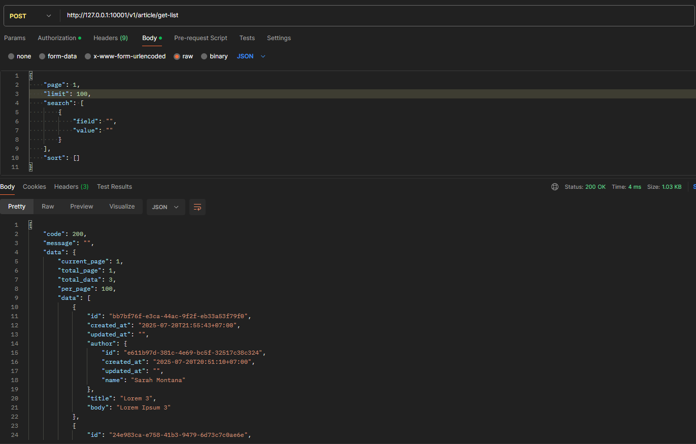
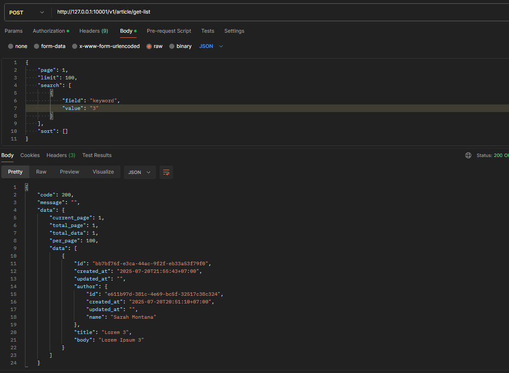
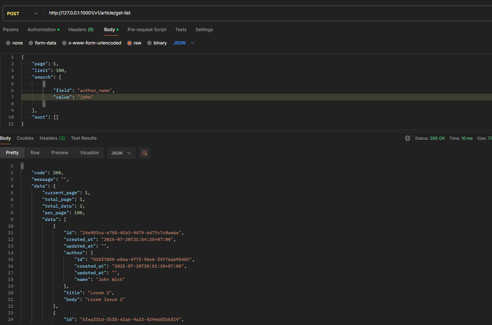
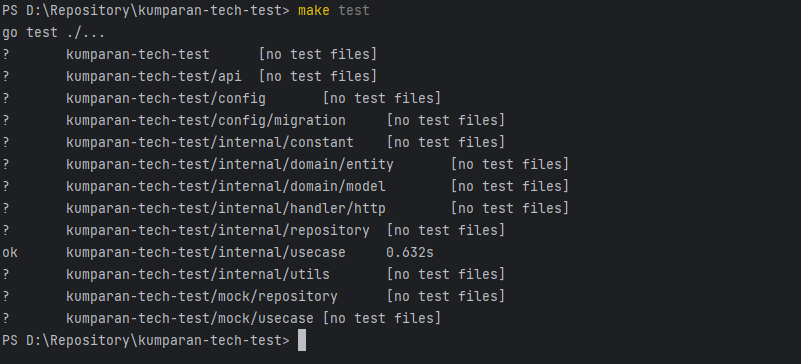

**Readme.MD**

## 1.Example .env
```
APP_VERSION=v1
DB_HOST=127.0.0.1
DB_NAME=postgres
DB_USER=postgres
DB_PASSWORD=PASSWORD
DB_PORT=5432
DB_SSL=disable
DB_TIMEZONE=Asia/Jakarta
DB_AUTO_MIGRATE=false
REDIS_ADDR=127.0.0.1:6379
REDIS_PASSWORD=
HTTP_HOST=127.0.0.1
HTTP_PORT=10001
```

## 2.Example database diagram



## 3.Example request & response

- API Create New Article (Success)


- API Create New Article (Failed)


- API Get List Article (Success - No Filter)


- API Get List Article (Success - Filter Keyword)


- API Get List Article (Success - Filter Author Name)


## 4. Unit test
